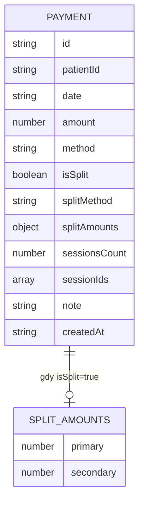

# feat: Płatność podzielona na dwie metody

## Przegląd

Umożliwienie zarejestrowania jednej płatności za pomocą dwóch metod jednocześnie
(np. 200 zł przelew Alior Bank + 50 zł gotówka). Dotyczy formularza rejestracji
płatności, widoku szczegółów, listy płatności, widoku sesji w kalendarzu oraz
wykresu przychodów wg metody.

## Ujęcie problemu

Pacjenci od czasu do czasu regulują należność mieszaną formą — część przelewem,
część gotówką. Obecny model `payment.method` to jeden string, więc takie zdarzenie
nie daje się odwzorować. Terapeuta musi albo ignorować podział (błędne dane
finansowe) albo tworzyć dwie osobne płatności za tę samą sesję (niespójność danych).

## Śledzenie wymagań

- R1. Formularz płatności umożliwia opcjonalne włączenie trybu „podzielonej płatności"
- R2. W trybie split terapeuta podaje metodę i kwotę dla każdej z dwóch części; suma musi równać się kwocie za wybrane sesje
- R3. Model danych przechowuje obie metody i obie kwoty przy zachowaniu wstecznej kompatybilności
- R4. Widok szczegółów płatności pokazuje podział (metoda 1: X zł + metoda 2: Y zł)
- R5. Wykres przychodów wg metody poprawnie przypisuje kwoty do odpowiednich słupków (nie do jednego)
- R6. Informacja o płatności podzielonej widoczna w modalu sesji w kalendarzu

## Granice scope'u

- Tylko dwie metody — nie trzy ani więcej
- Obie metody muszą być różne
- Edycja istniejącej płatności podzielonej działa tak samo jak edycja zwykłej
- Brak zmian w logice archiwizacji, eksportu ani DataRecovery
- Brak nowych stałych w PAYMENT_METHODS dla wartości 'split' — używamy nowych pól, nie nowej metody

## Kontekst i research

### Relevantny kod i wzorce

- `createPayment()` — `js/data.js` ok. linia 101: fabryka modelu płatności; tu dodajemy nowe pola
- `reconcilePaymentStatus()` — `js/data.js` ok. linia 626: po załadowaniu danych przypisuje `session.paymentMethod`; musi obsłużyć split
- `renderPaymentSheet()` — `js/views/finance.js` ok. linia 539: formularz rejestracji; tu dodajemy toggle + drugi rząd metoda/kwota
- `savePayment()` — `js/views/finance.js` ok. linia 731: zapis płatności; musi odczytać i zapisać dane split
- `renderPaymentDetail()` — `js/views/finance.js` ok. linia 862: szczegóły; musi wyświetlić podział
- `revenueByMethod()` — `js/views/finance.js` ok. linia 207: agregacja do wykresu; musi rozdzielić kwoty split
- `paymentMethodLabel()` / `paymentMethodClass()` — `js/views/finance.js` ok. linia 161–177: mapowanie metody na nazwę/CSS; wywoływane też w calendar.js
- `_paymentMethodName()` — `js/views/calendar.js` ok. linia 618: nazwa metody w modalu sesji; musi obsłużyć split

### Wiedza instytucjonalna

- Każda zmiana płatności wymaga bumpowania `CACHE_NAME` w `sw.js`
- `reconcilePaymentStatus()` jest autorytatywnym źródłem stanu `isPaid`/`paymentMethod` na sesji — wszelkie nowe pola split muszą być propagowane właśnie tu, nie w `savePayment()` bezpośrednio na sesji
- Istniejące płatności (bez pól split) muszą działać bez zmian — defaulty `isSplit: false` wystarczą

## Kluczowe decyzje techniczne

- **Backward-compatible model**: Dodajemy `isSplit: boolean`, `splitMethod: string|null`, `splitAmounts: {primary: number, secondary: number}|null` do obiektu `payment`. Pole `method` pozostaje jako pierwsza (lub jedyna) metoda. Pole `amount` to zawsze suma całkowita. Żadne istniejące pola nie zmieniają znaczenia.
- **Brak wartości 'split' w PAYMENT_METHODS**: Nie tworzymy nowej metody. Zamiast tego formatujemy etykietę dynamicznie: gdy `payment.isSplit`, wyświetlamy "Alior Bank + Gotówka" zamiast jednej nazwy.
- **Dwa osobne selecty metod w formularzu**: Toggle "podzielona" odsłania drugi rząd (select metody2 + pole kwoty2). Tylko kwota2 jest edytowalna przez użytkownika; kwota1 wylicza się automatycznie jako `total - amount2` i wyświetlana jest read-only. Kombinacja jest dowolna — użytkownik wybiera spośród Alior Bank / ING Bank / Gotówka dla każdej z form niezależnie.
- **reconcilePaymentStatus dla split**: Gdy `payment.isSplit`, sesja dostaje `session.paymentMethod = payment.method + '+' + payment.splitMethod` (string techniczny, nigdy nie mapowany na PAYMENT_METHODS). `_paymentMethodName()` i `paymentMethodLabel()` muszą obsłużyć ten format.
- **revenueByMethod dla split**: Zamiast dodawać `payment.amount` do jednej metody, dodajemy `splitAmounts.primary` do `payment.method` i `splitAmounts.secondary` do `payment.splitMethod`.

## Otwarte pytania

### Rozwiązane podczas planowania

- **Czy sesja ma wiedzieć o podziale?** Tak — `session.paymentMethod` powinno odzwierciedlać faktyczny podział dla spójności wyświetlania w kalendarzu (R6). Wartość złożona np. `'aliorBank+cash'` jest technicznie niespójna z PAYMENT_METHODS, ale to jedyne miejsce gdzie musi być "czytelna" — dlatego `_paymentMethodName()` i `paymentMethodLabel()` wymagają obsługi.
- **Co jeśli kwoty nie sumują się?** Walidacja w `savePayment()` przed zapisem — toast z błędem, brak zapisu.
- **Czy maksymalnie 2 metody?** Tak, świadoma decyzja scope'u. UI toggle binarny (split: tak/nie).

### Odroczone do implementacji

- Dokładna pozycja togglera w formularzu (przed/po listach sesji?) — ustalić empirycznie podczas implementacji
- Dokładny wygląd etykiety złożonej metody na liście płatności (jedna linia vs. dwie?) — zdecydować przy implementacji

## Diagram modelu danych

## Implementation Units

- [x] **Unit 1: Rozszerzenie modelu payment w data.js**

**Cel:** Model `payment` przechowuje dane split; `reconcilePaymentStatus()` poprawnie propaguje split na sesje.

**Wymagania:** R3

**Zależności:** Brak

**Pliki:**
- Modyfikuj: `js/data.js`

**Podejście:**
- W `createPayment()` dodaj z defaultami: `isSplit: false`, `splitMethod: null`, `splitAmounts: null`
- `splitAmounts` gdy istnieje: `{ primary: number, secondary: number }`
- W `reconcilePaymentStatus()`: jeśli `payment.isSplit`, ustaw `session.paymentMethod = payment.method + '+' + payment.splitMethod` (np. `'aliorBank+cash'`); w przeciwnym razie zachowaj dotychczasowe zachowanie
- Dodaj helper `isCompoundMethod(str)` który sprawdza czy string zawiera `'+'` — reużywany w warstwie UI

**Wzorce do naśladowania:**
- `createPayment()` defaulty: wzorzec `data.field || defaultValue`
- Istniejące pola `isPartiallyPaid` / `partialPaymentAmount` — analogiczny sposób rozszerzenia modelu

**Scenariusze testowe:**
- Płatność bez isSplit: `session.paymentMethod === 'aliorBank'` (bez zmian)
- Płatność z `isSplit=true, method='aliorBank', splitMethod='cash'`: `session.paymentMethod === 'aliorBank+cash'`
- `isCompoundMethod('aliorBank+cash')` → true; `isCompoundMethod('cash')` → false

**Weryfikacja:**
- Istniejące płatności po przeładowaniu danych działają identycznie jak przed zmianą
- Nowa płatność split ma poprawnie ustawiony `session.paymentMethod`

---

- [x] **Unit 2: Formularz rejestracji płatności — tryb split**

**Cel:** Użytkownik może włączyć tryb split i wypełnić dwie metody z kwotami.

**Wymagania:** R1, R2

**Zależności:** Unit 1

**Pliki:**
- Modyfikuj: `js/views/finance.js`

**Podejście:**
- W `renderPaymentSheet()` dodaj pod listą sesji toggle checkbox "Podziel płatność na dwie metody"
- Gdy toggle ON: pokaż dodatkowy wiersz z selectem metody2 + polem kwoty2; ukryj/zablokuj edycję jednego pola kwoty1 (auto = total − amount2)
- Gdy toggle OFF: wyświetl jeden select metody + jedno pole kwoty (bez zmian)
- W `savePayment()`:
  - Jeśli toggle OFF: zapisz jak dotychczas
  - Jeśli toggle ON: odczytaj method2 i amount2, oblicz amount1 = total − amount2, waliduj że amount1 > 0 i amount2 > 0 i method1 ≠ method2, zapisz `isSplit=true`, `splitMethod=method2`, `splitAmounts={primary: amount1, secondary: amount2}`
- Walidacja: jeśli `amount2 >= total` lub `method2 === method1` → toast z komunikatem, brak zapisu

**Wzorce do naśladowania:**
- Istniejące toggle metody płatności (przyciski z klasą `fin-method-btn`) w `renderPaymentSheet()`
- Pattern dynamicznego przeliczania kwoty: `selectedTotal()` wywoływana przy zmianie checkboxów sesji
- Toast w `savePayment()` dla walidacji brakujących pól

**Scenariusze testowe:**
- Formularz zwykły (toggle OFF): zapisuje payment z `isSplit=false` — zachowanie bez zmian
- Toggle ON, obie metody wypełnione poprawnie: zapisuje split payment
- Toggle ON, amount2 > total: toast "Kwota drugiej metody nie może przekraczać sumy sesji", brak zapisu
- Toggle ON, obie metody takie same: toast "Wybierz dwie różne metody", brak zapisu
- Toggle ON, amount2 = 0: toast o wymaganej kwocie, brak zapisu
- Edycja istniejącej split płatności: formularz pre-wypełniony z togglem ON i odpowiednimi wartościami

**Weryfikacja:**
- Można zarejestrować płatność 200 Alior + 50 gotówka za sesję 250 zł
- Płatność pojawia się na liście z informacją o podziale
- Sesja oznaczona jako opłacona

---

- [x] **Unit 3: Wyświetlanie split w UI (lista, szczegóły, modal sesji)**

**Cel:** Wszystkie miejsca wyświetlające metodę płatności poprawnie obsługują split.

**Wymagania:** R4, R6

**Zależności:** Unit 1

**Pliki:**
- Modyfikuj: `js/views/finance.js`
- Modyfikuj: `js/views/calendar.js`

**Podejście:**

*finance.js:*
- Zaktualizuj `paymentMethodLabel(method)`: jeśli `isCompoundMethod(method)`, rozdziel po `'+'` i zwróć `"Alior Bank + Gotówka"` (lub odpowiednie nazwy)
- Zaktualizuj `paymentMethodClass(method)`: dla złożonych metod zwróć klasę `'badge-split'` (lub neutralną)
- W `renderPaymentDetail()`: gdy `payment.isSplit`, dodaj wiersz podziału: "Podział: [method1]: X zł + [method2]: Y zł"
- W liście płatności (`renderPaymentRow()`): wyświetl dwa badge zamiast jednego gdy split

*calendar.js:*
- Zaktualizuj `_paymentMethodName(method)`: obsłuż format `'aliorBank+cash'` — rozdziel po `'+'` i zwróć czytelną etykietę

**Wzorce do naśladowania:**
- `paymentMethodLabel()` / `paymentMethodClass()` w finance.js — wzorzec switch/map do rozszerzenia
- `_paymentMethodName()` w calendar.js — analogiczny switch

**Scenariusze testowe:**
- Lista płatności: split payment pokazuje "Alior Bank + Gotówka" (nie "undefined")
- Szczegóły płatności: widoczny podział kwot (200 zł + 50 zł)
- Modal sesji w kalendarzu: pole "Metoda" pokazuje "Alior Bank + Gotówka"
- Zwykła płatność (isSplit=false): bez zmian w wyświetlaniu

**Weryfikacja:**
- Żadne miejsce w UI nie wyświetla surowego stringa `'aliorBank+cash'`
- Szczegóły split płatności zawierają czytelny podział kwot

---

- [x] **Unit 4: Wykres przychodów wg metody — agregacja split**

**Cel:** Split payment jest poprawnie rozbijany na dwie metody w wykresie słupkowym.

**Wymagania:** R5

**Zależności:** Unit 1

**Pliki:**
- Modyfikuj: `js/views/finance.js`

**Podejście:**
- W `revenueByMethod()`: jeśli `payment.isSplit`, dodaj `splitAmounts.primary` do kubełka `payment.method` i `splitAmounts.secondary` do kubełka `payment.splitMethod` — zamiast dodawać `payment.amount` do jednej metody
- Jeśli `payment.isSplit` ale `splitAmounts` jest null (legacy/błąd danych): fallback do `payment.amount` przypisanego do `payment.method`

**Wzorce do naśladowania:**
- Istniejąca pętla w `revenueByMethod()` iterująca po `AppState.payments`

**Scenariusze testowe:**
- 200 zł Alior + 50 zł gotówka: Alior bucket += 200, cash bucket += 50 (nie: Alior += 250)
- Zwykła płatność 250 zł Alior: Alior bucket += 250 (bez zmian)
- Mieszanka zwykłych i split: sumy per metoda sumują się poprawnie

**Weryfikacja:**
- Łączna kwota na wykresie (suma słupków) = suma wszystkich płatności
- Split payment nie jest liczony podwójnie ani przypisany do złej metody

## Wpływ systemowy

- **reconcilePaymentStatus**: Kluczowa funkcja synchronizująca stan — musi być zaktualizowana w Unit 1, bo jest autorytatywna dla `session.paymentMethod`
- **Propagacja do sessions**: `session.paymentMethod = 'aliorBank+cash'` to nowy format — wszystkie miejsca odczytujące to pole muszą obsługiwać `'+'` (calendar.js, patients.js jeśli wyświetla metodę)
- **Ryzyka cyklu życia stanu**: Płatność split usunięta → sesja wraca do `isPaid=false` — tu logika bez zmian; edycja split → reconcile ponownie aplikuje

## Ryzyka i zależności

- `patients.js` może wyświetlać `session.paymentMethod` w widoku szczegółowym sesji — sprawdzić przy implementacji czy wymaga analogicznej obsługi `'+'` (prawdopodobnie tak)
- Brak testów automatycznych w projekcie — weryfikacja manualna na rzeczywistych danych; szczególna uwaga na istniejące płatności po migracji modelu

## Dokumentacja / Notatki operacyjne

- Bump `CACHE_NAME` w `sw.js` wymagany przy każdym commicie zmieniającym JS
- Istniejące dane nie wymagają migracji — `isSplit` defaultuje do `false`, brak destructive change

## Źródła i referencje

- Powiązany kod: `js/data.js` (createPayment, reconcilePaymentStatus), `js/views/finance.js` (renderPaymentSheet, savePayment, revenueByMethod), `js/views/calendar.js` (_paymentMethodName)
